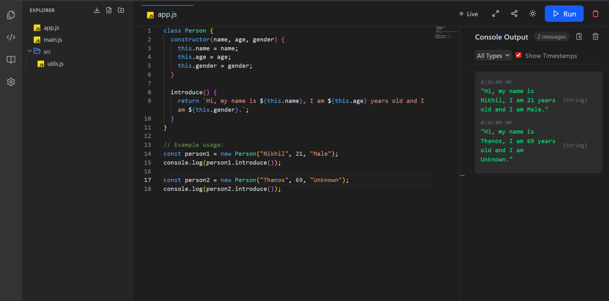

# JavaScript Online Code Editor

An online code editor for JavaScript that allows users to write, execute, and debug JavaScript code in a web-based environment.

## 📸 Preview
<p align="center">
  
</p>

## Features
- Real-time JavaScript execution
- Syntax highlighting
- Auto-completion (if implemented)
- Error handling and debugging
- Dark mode support (if applicable)
- Save and load code snippets

## Installation
Clone the repository and open the project in your local development environment:

```sh
git clone https://github.com/nikhilsundriya/WebCrafter.git
cd WebCrafter
```

Then, install dependencies (if any):

```sh
npm install
```

## Usage
Start the development server:

```sh
npm run dev
```

Or open `index.html` in your browser if it is a static project.

## Contributing
Feel free to contribute by submitting issues or creating pull requests.

## License
This project is licensed under the [MIT License](LICENSE).

## Demo
You can try the live demo here: [Live Demo](https://web-crafter-nikhil.vercel.app/)

## Author
Developed by Nikhil Sundriya
